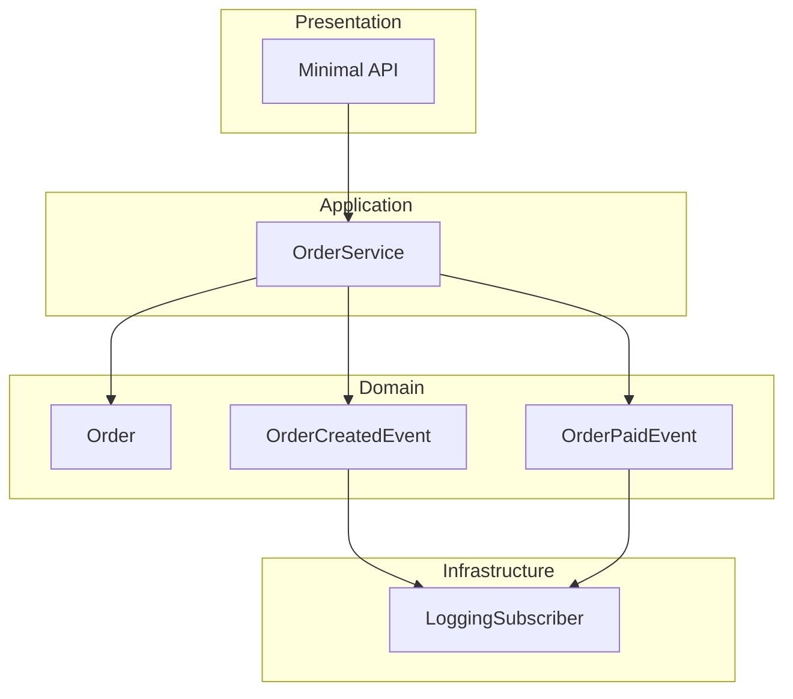

# Event-Driven Orders – ASP.NET Core Minimal API

This project is a learning-focused implementation of **Event-Driven Architecture** using **ASP.NET Core Minimal API (.NET 8)**.

The goal of this project is to deeply understand:

* How events work in C#
* How to apply the **Observer pattern** in a real application
* How to design loosely coupled systems using events
* How Minimal APIs can be used to build clean and modern backends

---

## 🧠 Why Event-Driven?

In traditional layered applications, services often depend directly on other services (logging, notifications, persistence, etc).

In this project:

* The core business logic **does not know** who reacts to events
* New behaviors can be added **without modifying existing logic**
* The system becomes more **flexible, extensible, and testable**

---

## 🏗️ Architecture Overview

The application is structured into clear layers:

* **Presentation**
  ASP.NET Core Minimal API endpoints

* **Application**
  Application services and event publishing

* **Domain**
  Core business entities and domain events

* **Infrastructure**
  Event subscribers (e.g., logging)

The architecture follows:

* Event-Driven Architecture
* Observer Pattern
* Clean Separation of Concerns

---

## 📐 Architecture Diagram



---

## 🔄 How Events Flow

1. A client sends an HTTP request to the API
2. The API calls the `OrderService`
3. The service performs business logic
4. An event is raised (e.g. `OrderCreatedEvent`)
5. One or more subscribers react to the event

The service does **not** know who is listening.

---

## 🚀 How to Run

### Prerequisites

* .NET 8 SDK
* Visual Studio 2022 or later

### Steps

```bash
git clone https://github.com/YOUR_USERNAME/event-driven-orders.git
cd event-driven-orders
dotnet run
```

---

## 🧪 Example API Usage

### Create Order

```
POST /orders
```

```json
{
  "customerName": "Abdelrahman",
  "amount": 1500
}
```

### Pay Order

```
POST /orders/{orderId}/pay
```

---

## 🧩 Current Features

* Minimal API (.NET 8)
* Order domain model
* OrderCreated / OrderPaid events
* In-memory event publishing
* Logging subscriber

---

## 🛠️ Planned Improvements

* Email / Notification subscribers
* Event Bus abstraction
* Async event handling
* Persistence layer
* Integration tests

---

## 📚 Learning Notes

This project was built step by step with a strong focus on:

* Understanding **why** each decision was made
* Avoiding tight coupling
* Writing readable and maintainable code

It is intentionally kept simple to emphasize architectural concepts rather than frameworks.
